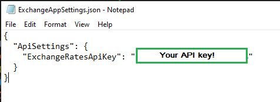

# ExchangerateApi

## Simple '.NET Core C# Web API' and 'html, css, JS' application.

### Picture from project

ExchangerateApi/FrontEnd/index.html 

https://localhost:7000/swagger/index.html 

### How to run project

### :exclamation::exclamation::exclamation: Download and install :exclamation::exclamation::exclamation:

.NET 6.0  
https://dotnet.microsoft.com/en-us/download

1. Clone or Download and extract all files and folders inside 'ExchangerateApi'.

   - ExchangerateApi
     - DotNETBackEnd
     - FrontEnd
     - readme_pics
     - ExchangeAppSettings.json
     - README.md
     - .gitignore
     - start-apps.bat

2. Launch ASP.NET web API and index.html project.

   - :exclamation: GO TO https://www.exchangerate-api.com/ and get your 'API Key' :exclamation:

     - Cut or copy 'ExchangeAppSettings.json' and paste it inside './ExchangerateApi/DotNETBackEnd/ExchangerateApi'
     - And paste your 'API Key' as value `"ExchangeRatesApiKey": "your_api_key_value"`
     - 

   - 2.1 If you are on Windows OS - Double click 'start-apps.bat' file in root directory.
   - 
   - If windows defender or antivirus says it is unsafe (you can open it in texteditor and look that is safe) you can still run it.
   - This should open 1 Command Prompts and default Web Browser.
     - It needs to run .NET backend.
     - You can run .bat file again if something gues wrong. Or run each one manually.
   - :exclamation: Wait until all is loaded and start using ./ExchangerateApi/FrontEnd/index.html

   OR

   - 2.2 Launch using cmd or powershell.

     - 2.1.1 Go to ExchangerateApi/DotNETBackEnd/ExchangerateApi directory
     - 2.1.2 Open CMD (Command prompt) or powershell there and type 'dotnet run'
     - 2.1.3 Go to ExchangerateApi/FrontEnd and open index.html for frontend.

3. Go to Web Browser.

   - Go to https://localhost:7000/swagger/index.html for 'Swagger UI'.
   - Go to ExchangerateApi/FrontEnd and open index.html for frontend.

4. Use functionality.

   - exchange rates
     - Inside ExchangerateApi/FrontEnd/index.html (in browser).
     - By default you can pick one of currencies "EUR", "GBP", "USD", "AUD", "CAD", "HKD", "NZD" enter amount and press convert.
     - You can use 'Swagger UI' to try 'https://localhost:7000/api/Exchangerates/NZD' where 'NZD' is currency.

### Improvements

- Create NextJS or Angular Front End.
